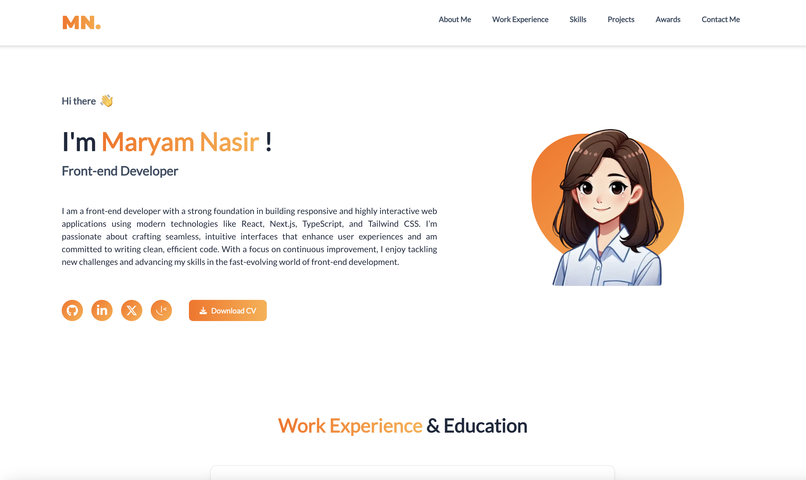

# My Portfolio Project

This project is my personal portfolio showcasing my projects, skills and work experience. It is built using Next.js and is fully responsive. Access [here](https://portfolio-project-brown-sigma.vercel.app/).



## Table of contents

- [Tech Stack](#tech-stack)
- [Features](#features)
- [Getting Started](#getting-started)
- [Access the Deployed version on Vercel](#access-the-deployed-version-on-vercel)

## Tech Stack:

- Next.js
- TypeScript
- Tailwind CSS
- MongoDB
- Mongoose
- Framer Motion

## Features:

- **About Me Section**: Beautiful About Me section which highlights my background as a software engineer with expertise in front-end technologies.

- **Work Experience and Education Section**: Includes details of my professional journey, providing information about my roles at different software companies, along with my academic credentials and achievements.

- **Skills Section**: A comprehencive list of my technical proficiencies.

- **Projects Section**: This section showcases some of my projects I completed as part of my front-end development journey. Each project has a link to live site, github repository link, a brief description and technologies used.

- **Awards Section**: A list of the accomplishments and awards I received.

- **Contact Me Section**: A form to get in touch with me for potential collaborations or inquiries. The message will be directly sent to my email address.

## Getting Started

Follow these steps to set up the project locally on your machine.

**Prerequisites**<br />
Make sure you have the following installed on your machine:

- [Node.js](https://nodejs.org/en)

**Clone the Repository**

```
git clone https://github.com/maryam-nasir/portfolio-project.git
cd portfolio-project
```

**Installation**<br />
Install the project dependencies using npm:

```
npm install
```

**Set Up Environment Variables**<br />
`.env` file is only required for Contact Me section which will send email to my email address. Rest of the app will function fine without it too.

Create a `.env` file at the root of the project and copy the following content:

```
NEXTAUTH_URL=http://localhost:3000
NEXTAUTH_URL_INTERNAL=http://localhost:3000
MONGODB_URI=
DB_NAME=portfolio
MY_EMAIL=
MY_PASS=
MY_DEST_EMAIL=
```

Replace the placeholder values with your actual credentials:  
`MONGODB_URI`: Put the link of your MongoDB cluster here.  
`MY_EMAIL`: Email address to be used for sending email.  
`MY_PASS`: Password for above email account.  
`MY_DEST_EMAIL`: Email address where you want to send the email.

**Running the Project**<br />
Run:

```
npm run dev
```

Open [http://localhost:3000](http://localhost:3000) in the browser to view the project.

## Access the Deployed version on Vercel

The app is deployed on Vercel and can be accessed here: [Personal Portfolio](https://portfolio-project-brown-sigma.vercel.app/).
